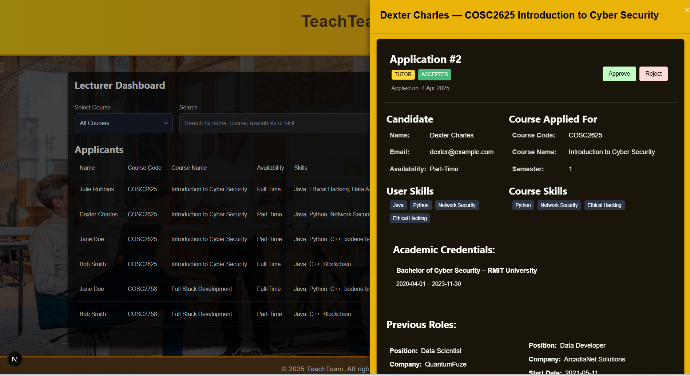
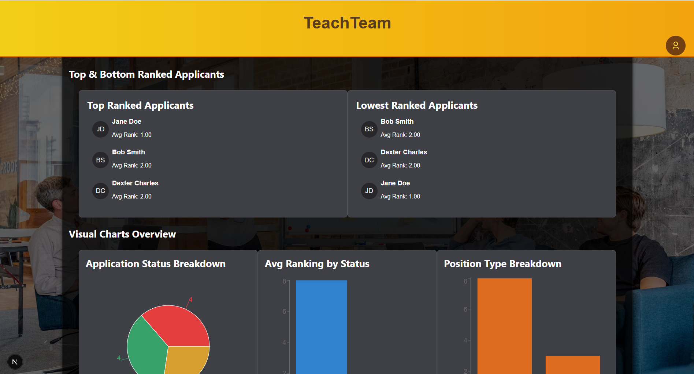
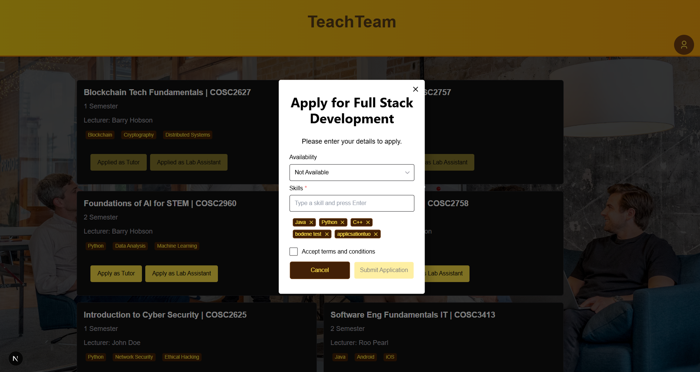

🎓 **Bachelor of Cyber Security student at RMIT University**  
💻 **Full-stack developer & security enthusiast**  
📍 Melbourne, Australia

## Hi, I'm Bodene

Cyber Security student at RMIT (graduating 2026) with a strong focus on **networking, infrastructure, and system deployment**.

I build and manage real-world applications in live environments, with hands-on experience in:
- Linux server administration
- VPS deployment and configuration
- Networking (ports, DNS, routing, connectivity)
- Troubleshooting production issues
- Deployment workflows and system reliability

---

## Infrastructure & Deployment Experience

I currently run a production application hosted on a VPS, where I:

- Deploy and manage a full-stack application in a Linux environment
- Configure networking (ports, localhost routing, external access)
- Work with SSH and remote server access
- Diagnose and resolve real-world issues including:
  - connection timeouts
  - SSH access failures
  - services not accessible externally
  - application downtime after restart
- Investigate logs and system behaviour to identify root causes
- Manage multiple services on a single host

---

## Key Technical Skills

**Infrastructure & Systems**
- Linux (Ubuntu server environments)
- VPS hosting (Hostinger)
- Networking fundamentals (TCP/IP, DNS, ports)
- Nginx (reverse proxy concepts)
- System monitoring and log analysis

**Development**
- JavaScript / TypeScript (Next.js)
- Python / Java
- Git & version control

**Cloud & DevOps**
- CI/CD concepts (Git-based workflows)
- AWS fundamentals (EC2, architecture concepts)

**Cyber Security**
- Nmap, Nessus, Wireshark
- OWASP Top 10
- Vulnerability scanning basics

---

## Featured Projects

### VPS Infrastructure & Deployment (Private Project)
Production deployment of a full-stack application hosted on a VPS.

Focus areas:
- Server setup and configuration
- Networking and connectivity
- Troubleshooting real-world failures
- System reliability and uptime

 *Repository is private, but I’m happy to walk through architecture and deployment setup.*

---

### Cloud Security & Cryptography Projects
- Kerberos authentication (simplified implementation)
- Diffie-Hellman key exchange
- Site-to-site VPN concepts
- AES-CBC encryption
- Shamir Secret Sharing
- Paillier Homomorphic Encryption

---

## Career Focus

I’m currently seeking a **graduate role in networking, infrastructure, cybersecurity, or cloud systems**, with a strong interest in positions that involve real-world system environments and operational problem solving.

- Work on real-world systems and environments
- Continue developing deep technical capability
- Contribute to reliable, scalable, and secure infrastructure

---

## Connect with me

- LinkedIn: https://www.linkedin.com/in/bodenedownie/

---

## Tech Stack & Tools

---

## 📌 Featured Projects

### [TeachTeam Lecturer Portal](https://github.com/TeachTeam-Milestone1)
> Visual insights dashboard for managing and ranking student applications.  
> **Tech:** React, Node.js, PostgreSQL, Recharts, Chakra UI.  

---

### [EyeClear E-Commerce Website](https://github.com/YOUR-REPO-LINK)
> UML diagrams and prototype for an eyewear e-commerce platform.  
> **Tech:** Java, JSP/Servlets, MySQL, UML.  

---

### [Cloud Security Labs](https://github.com/YOUR-REPO-LINK)
> AWS VPC architecture, S3 bucket policies, Elastic Load Balancing, Paillier Homomorphic Encryption demos.  
> **Tech:** AWS, Python, JavaScript, Encryption, Lambda.  

---

### [Blockchain Fundamentals Assignments](https://github.com/YOUR-REPO-LINK)
> NFT migration plan and Solidity smart contracts from INTE2627.  
> **Tech:** Solidity, Hardhat, JavaScript, HTML/CSS.

---

## 📫 Connect With Me

- 💼 [LinkedIn](https://www.linkedin.com/in/bodenedownie/)

---

## 📊 GitHub Stats

---
